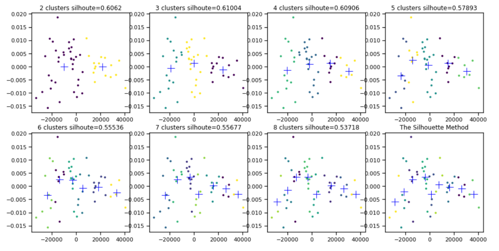
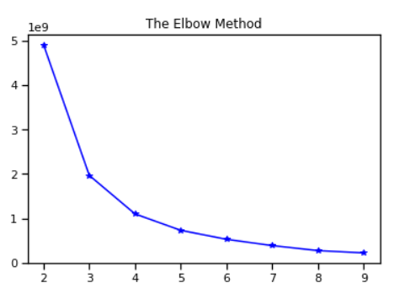
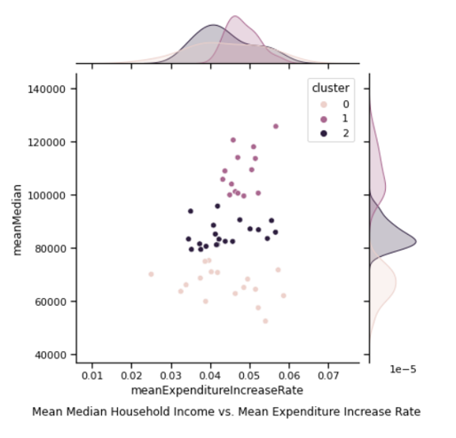
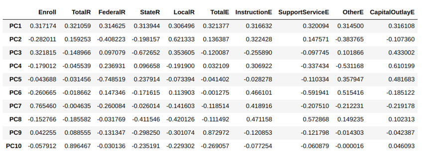
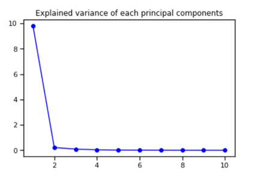
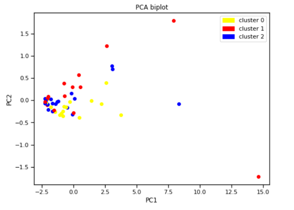
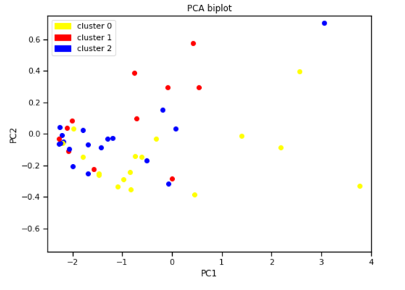
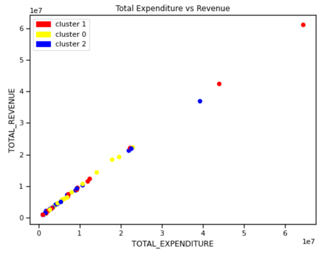
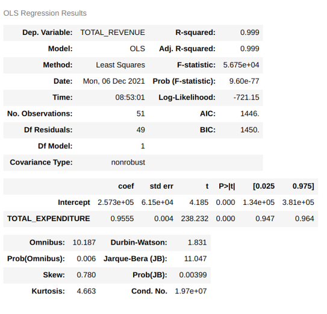
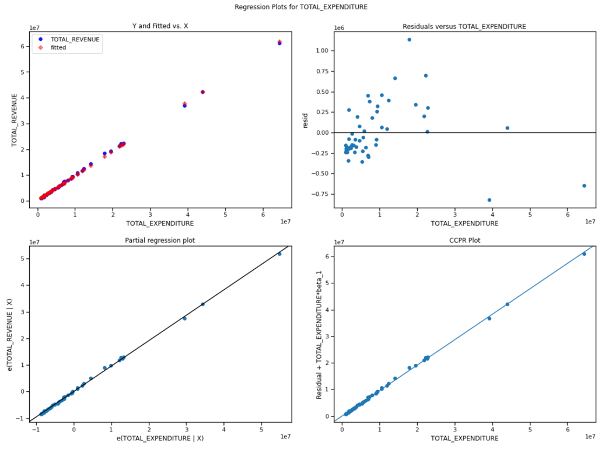

# Exploratory Analysis on the Methods for States with High Educational Investment and Low Household Income to Increase Household Income


Zhe Yang

December 6, 2021

SI 618, Project 1 - Part 2


## Motivation
This part of the project is the additional exploratory analysis of the previous analysis of part 1 on the relationship between educational expenditure and household income in the US. In part 1, I found that a generally high increase rate in education expenditures would result in high household income for each state. However, there are states making efforts on increasing their education investment year by years but yet having relatively low household income. In this part of the project, I would like to figure out what exactly these states are, what differences between them and those states with high household income in terms of detailed investment features and try to provide some suggestions for them to increase household income. It is important to make sure that government investment efficiently makes positive changes to people's livelihood. It is depressing if the government actually invests money but people's lives don't change a lot. In terms of educational expenditures, if some states can invest money to increase people's income, then other states can do it similarly. Fortunately, by exploring some detailed investment features provided by the US Educational Finances dataset, we can realize this purpose.

This part of project mainly seeks to research on the following three questions:
1. Are there any meaningful clusters among the states with different educational expenditure increase rate and household income?
2. What are the differences between the detailed educational expenditures among these clusters?
3. Given that some states need to increase their educational expenditures, is there a positive linear relationship between educational expenditures and revenues?

## Data Sources
I use two datasets in this project.

### US Educational Finances
The first dataset contains the educational revenues and expenditures of the elementary and high schools in different school districts of different states from 1992 to 2016. It also has 10 features about the educational finances of each state, including the following.
1. The number of students enrolled
2. Total educational revenue
3. Federal educational revenue
4. State educational revenue
5. Total educational expenditure
6. Instruction educational expenditure
7. Support service educational expenditure
8. Other educational expenditure
9. Capital outlay educational expenditure

The data are available on Kaggle: [U.S. Educational Finances](https://www.kaggle.com/noriuk/us-educational-finances) and are in `csv` format.

### US Household Income Statistics
The second dataset contains the statistics (including mean, median,standard deviation, etc.) of US household income in different counties of different states. The statistics are all averages from 2011 to 2015. The data are captured in 2017 and available on Kaggle: [US Household Income Statistics](https://www.kaggle.com/goldenoakresearch/us-household-income-stats-geo-locations) and are in `csv` format.

## Methods

### Problem 1: Are there any meaningful clusters among the states with different educational expenditure increase rate and household income?
For this question, I use the manipulated data from part 1 of the project, which join the household income together with the annual increase rate of educational expenditures from 1992 to 2016 of each state. I use SparkSQL to do a left join and then compute the annual increase rate. Please refer to the Problem 2 of my part 1 report for details.

### Problem 2: What are the differences between the detailed educational expenditures among these clusters?
I only need to use the US Educational Finances dataset for this problem so there is no dataset join needed. There are NaN values in 1992 in the US Educational Finances dataset. Hence, I remove all of the NaN values by the ```df.dropna()``` function and the resulting dataset contains the data from 1993 to 2016. I then compute the medians of each feature of each state among these years and use them as average descriptions of the features. The reason why I use medians instead of means is that I want to eliminate the effect of extremely large or small values. As for noisy data, because these data are about each state, I think they are all valuable and none of the states should be regarded as "noisy" data. It is somehow challenging to copy the clusters in Problem 1 and use them here. I do an additional dataframe join using the ```df.join``` function to copy the clusters computed in Problem 1 to the dataset in Problem 2. I join them using states as keys.

### Problem 3: Given that some states need to increase their educational expenditures, is there a positive linear relationship between educational expenditures and revenues?
Similar to Question 2, I only need to use the US Educational Finances dataset for this problem so there is no dataset join needed. I do the same to remove NaN values and join the clusters computed in Problem 1.

## Analysis and Results

### Problem 1: Are there any meaningful clusters among the states with different educational expenditure increase rate and household income?
To answer this question, I want to perform a K-means clustering algorithm. To do that, I first need to decide how many clusters I would use. I use the Elbow Method and the Silhouette Method. In the Silhouette Method, the average silhouette reaches its maximum when the number of clusters is 3.



Also in the Elbow Method, after k=3 the decrease rate of within-cluster sum of squares drops significantly. 



Hence, I choose 3 clusters for the K means algorithm and perform it on the graph of **the median household income of all the counties of each state vs. the mean expenditure increase rate of each state** drawn in the part 1 of the project. The graph basically shows the normalized relationship between how much each state pays attention to education expenditure from 1992 to 2016 and the median household income of each state in 2015. Please refer to the report of part 1 for more details. 



From the above figure we can notice that K means algorithm clusters the data basically based on the vertical axis, i.e. the mean median household income. States in cluster 1 have generally the highest household income. We can notice that they mostly have a high mean expenditure increase rate. States in cluster 2 have relatively lower household income and lower mean expenditure increase rate. States in cluster 0 basically follow the same trend. After clustering, we can clearly find that the structure of these data points presents in a triangle form, which suggests that if a state has high household income, it must have a high expenditure increase rate; but if a state has high expenditure increase rate, it is not necessary to have high household income. It is very interesting to find such a pattern. One probable cause of that may be that although states in cluster 0 make a similar amount of efforts to invest in education, they spend the money on something different, or even something wrong. Hence, the next interesting question is what are the differences between the detailed educational expenditures among these three clusters.


### Problem 2: What are the differences between the detailed educational expenditures among these three clusters?
To answer this question, I can depend on the 11 features provided in the US Educational Finances dataset, including the total educational expenditure, total educational revenue, number of students enrolled, etc. I compute the median values of these 11 features from 1992 to 2016 of each state and use them as To reduce the dimension, I perform a PCA on these features and try to extract significant ones. The weight of each principal component (PC) is given by the table below.



The "R" in the table means "Revenue" and the "E" means "Expenditure". For example, "FederalR" means "Federal Revenue". I also plot the explained variances of each PC as below.



We can find the first and second PCs explain most of the variances. Hence, I plot the data points in the three clusters in problem 1 in a graph whose horizontal axis is PC1 and vertical axis is PC2.



We can find that there are several points lying on the very right part of the graph. They make us unable to see the details in the group of points on the left side. Somehow I would regard them as sort of outliers so I limit the range of the horizontal axis and the graph becomes the following.



We can notice that the most differences between cluster 0 (the states with lowest household income) and cluster 1 (the states with highest household income) are presented on PC2. Data points in cluster 0 have lower PC2 while data points in cluster 1 have higher PC2. As PC1 goes higher the differences in terms of PC2 becomes bigger. Referring to the table with weights of each PC above, we can find that all weights are positive for PC1 and the "Total Revenue", "Local Revenue", "Total Expenditure", "Instruction Expenditure", "Support Service Expenditure" weights are positive for PC2. By analyzing these weights, we may find the detailed differences between cluster 0 and 1 and make some suggestions based on that to increase the household income for states in cluster 0.

Firstly, states in cluster 0 have generally lower educational expenditures than those in cluster 1. That means although they may share a similar increase rate of expenditures, they still have a difference in terms of the actual quantity of expenditures which may cause the difference of household income. Maybe states in cluster 0 still need to increase their educational expenditure further to increase the household income. Secondly, the high weight on local revenue of PC2 suggests that the states in cluster 1 have much higher local revenue compared to those in cluster 0, which means the revenue of states in cluster 0 mostly go to the state and federal government. That probably means the educational revenues should be better kept by local counties to make additional investment to local education. It is probably a more efficient way compared to handing them up to the state and federal government and waiting for them to distribute additional expenditures back to local counties. Finally, the weights of instruction expenditures and support service expenditure are positive. That means the expenditures should mostly be spent on these two.

Based on the first finding above, states in cluster 0 need to increase their expenditures additionally. However, does that create a corresponding increase in the revenues? If that is not the case, it could probably cause financial difficulties. Hence, the next question is whether there exists some positive linear relationship between educational expenditures and revenues.

 
### Problem 3: Is there a positive linear relationship between educational expenditures and revenues?
 
To answer this problem, I first plot the data points in the three clusters in a graph whose horizontal axis is total education expenditures and vertical axis is total educational revenues. 



We can notice a very good linear positive relationship among all data points. There is no difference among all three clusters. It is indeed a good sign. I additionally perform an ordinary least square estimation as below.



It is a fantastic result. The R-squared value is 0.999 which means it is very probable that there exists a linear relationship. The coefficient of the total expenditures is 0.9555 suggesting a positive relationship. I additionally draw some diagnostic plots as follows.



All the diagnostic plots are perfect. The fitted values and actual values are close. The residuals are basically random among the independent values. The points on the partial regression plot and CCPR plot fit to the line.

Hence, we can say there exists a strong linear positive relationship between educational expenditures and revenues. The states in cluster 0 can invest more money and probably receive more revenues back. As long as most of these revenues can be kept in the local counties, we can expect a household income increase after several years.


